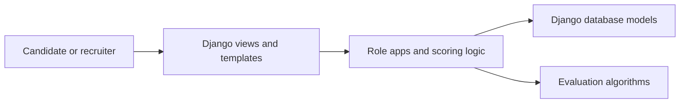
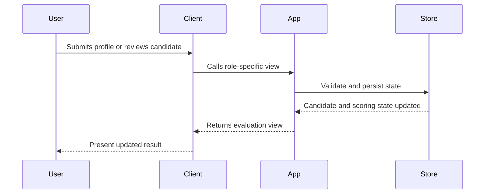

# Architecture

AIP uses Django apps to separate account, candidate, recruiter, and maintainer responsibilities. Scoring and relevancy logic sits alongside web workflows and should be treated as decision-support logic.

## Component View

## Key Components

- Account and role-specific Django apps
- Candidate scoring and relevancy algorithms
- Templates and static assets
- Django settings and management commands

## Main Workflow

## Design Considerations

- Keep scoring criteria explainable
- Separate candidate input from recruiter decision flow
- Log enough context for later review and appeal

